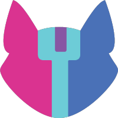

<!-- ### Hi there 👋 -->

  

  
  
  
  
  

  
  <h1>
    Hey there
    
  </h1>

  

---

### :man_technologist: About Me :

I am University of Windsor graduate from India.

- 🔭 I’m currently working on developing my programming skills.
- 🌱 I’m currently learning Hardware Security.
- :zap: In my free time, I solve programming (AoC) , machine learning (kaggle) and math (brilliant) problems and read tech articles.
<!-- - 👯 I’m looking to collaborate on 
- 🤔 I’m looking for help with ...
- 💬 Ask me about ... -->
- 📫 How to reach me: [e-mail](mailto:mohit12562@gmail.com), or , or 
- 😄 Pronouns: He/Him

---

### :hammer_and_wrench: Languages and Tools :

  &nbsp;

  
  &nbsp;
  &nbsp;
  &nbsp;
  &nbsp;
  &nbsp;
  &nbsp;
  &nbsp;
  &nbsp;

  &nbsp;
  &nbsp;
  &nbsp;
  &nbsp;
  &nbsp;
  &nbsp;
  &nbsp;

  &nbsp;
  &nbsp;
  &nbsp;
  &nbsp;
  &nbsp;

  
  &nbsp;

  &nbsp;

  &nbsp;

  &nbsp;
  &nbsp;
  &nbsp;
  &nbsp;
  &nbsp;

---

### :fire: My Stats :

